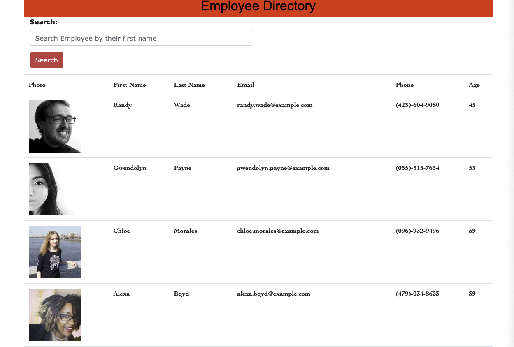

# Employee-Directory

## Description
>The purpose of this application is to view an entire employee directory at once for quick access of their information. It is useful for  the employee to quickly filter of an employee by thier first name.

## Challenges

>Had several deployment issues. 

## Technologies Used

>HTML |
>CSS |
>JavaScript |
>React.js |
>Bootstrap |

## Deployment Link

- https://elhiloyasin.github.io/Employee-Directory/

>[Repository-Link](https://github.com/elhiloyasin/Employee-Directory1)

## REPOSITORY LINK

- 

## SCREENSHOT OF APPLICATION

- 

## Contact Me

>Visit my Github profile at https://github.com/elhiloyasin.

>Email: elhiloyasin@gmail.com

  ## Acknowledgments

  > Thanks to __Daniel Mestawat__ for assisting me in completing this Homework. I truely want to credit him for his assitance. Here is _Daniel Mestawat_ github. 

  > Check out __Daniel Mestawat__ Github profile at https://github.com/danny1215.

